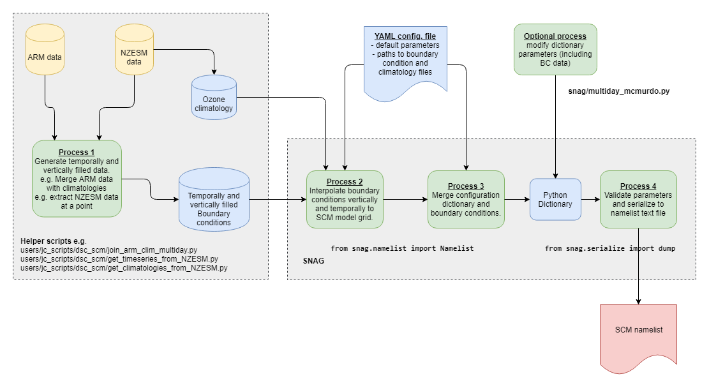

SNAG
====

The Single column model Namelist Auto Generator
-----------------------------------------------

This package is designed to enable users of the UM Single Column Model (SCM) to be able to create and modify the namelist file required by the SCM in a Pythonic way.

It is currently only set up for observational forcing cases only.

Installation
------------

Install the latest version of the package downloading or cloning the code from git (https://github.com/bodekerscientific/snag) and running setup.py

Overview of SNAG process
------------------------

SNAG reads a YAML configuration file and atmospheric boundary condition input data, vertically interpolates data onto the SCM grids, calculates the tendencies required for the specified forcing/relaxation options, checks the consistency of some of the namelist options (mainly related to time and surface type), then writes the namelist to a Fortran namelist file. Users can optionally perturb any variables in the dictionary (e.g. tendencies) before they are written to the namelist. The user can also generate the namelist from their own python dictionary if required. Separate code is supplied to create the input data needed.

Getting Started
---------------

How to use the package

Run from command line

from snag import create_namelist

create_namelist(conf, stream=None)

where conf is Dict-like object or a filename to a yaml file containing the configuration, and stream is a stream like object for example an open file. If nothing is provided then a string containing the configuration is returned.

Or use a script such as test_mcmurdo.py to read in, manipulate the data and write to file.

Required input data files
-------------------------

- netCDF files containing the gridded input data covering the height and time required by the model.
- a YAML configuration file specifying model options to be set in the namelist.

We would suggest you start by taking the example YAML file and modifying for your case. A description of the different namelist variables and how they relate to other variables is given in the example yaml files (e.g. mcumurdo_land.yml), and further documentation can be found in the UMDP C09.

Required variables for atmospheric boundary conditions

- temperature
- Pressure
- specific humidity
- u + v winds
- w winds + vertical movement due to horizontal advection
- ozone

NOTES
-----
- The following values specified in the YAML file for the initial time, run length, and number of forcings are OVERRIDDEN BY INPUT DATA after being checked for consistency with those in the YAML file.

    - CNTLSCM: nfor,
    - INDATA: year_init, month_init, day_init, hour_init, min_init, sec_init
    - RUNDATA: ndayin, nminin, nsecin

- Note that the tendencies and background variables in the observational forcing include the initial time. The namelist validation will check that the requested simulation length (ndayin + nminin + nsecin) is consistent with (length of input data - 1) * obs_pd and (nfor - 1) * obs_pd
- Note that tendencies (_inc) are given in units per day, so look quite large.
- The observation period (INOBSFOR:obs_pd) must be a multiple of the timestep (RUNDATA:timestep).
- Radiation timesteps are set in the UM namelists run_radiation:i_lw_radstep_perday_prog and run_radiation:i_sw_radstep_perday_prog.

YAML notes

- Take care with scientific notation for numbers: 1.0e-4 will be interpreted as a number, but 1e-4 will incorrectly display as a string in the resulting namelist. This will break the build and show up as an "input conversion error" in the Rose error log.
- List arrays as [1.5, 1.3, 1.2]

For land points

- Specify initial temperatures (in &INPROF) as well as soil moisture through either smcli or sth (&INJULES). The number of (deep) soil layers is set in ROSES using variable st_levels.

